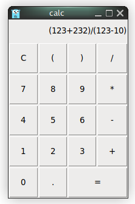
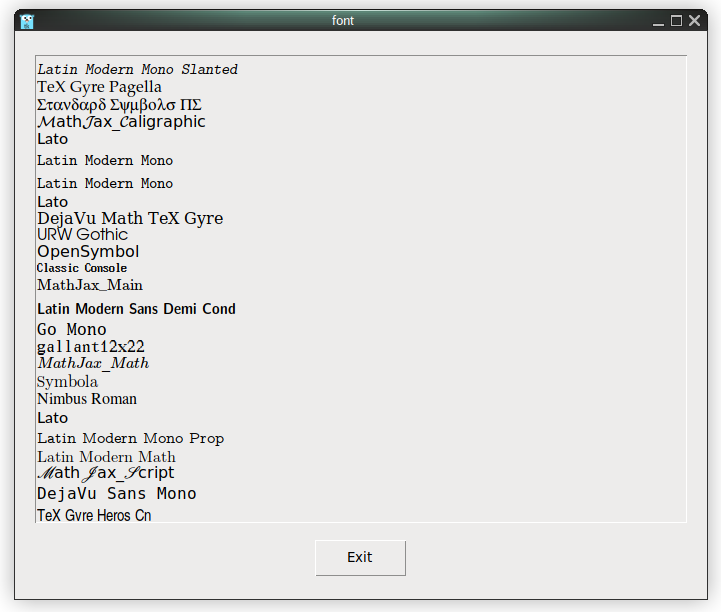
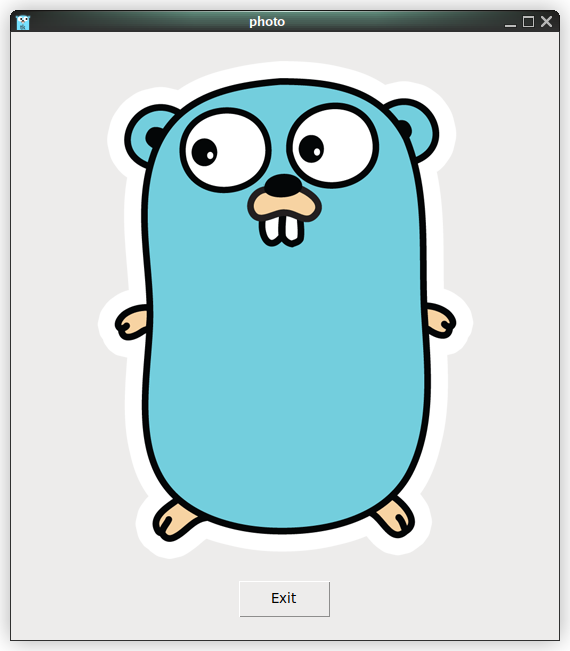

# tk9.0: CGo-free cross platform GUI for Go

A simple calculator (examples/calc.go).

     1	package main
     2	
     3	import "github.com/expr-lang/expr"
     4	import 	. "modernc.org/tk9.0"
     5	
     6	func main() {
     7		out := Label(Height(2), Anchor("e"), Txt("(123+232)/(123-10)"))
     8		Grid(out, Columnspan(4), Sticky("e"))
     9		var b *Window
    10		for i, c := range "C()/789*456-123+0.=" {
    11			b = Button(Txt(string(c)), Command(
    12				func() {
    13					switch c {
    14					case 'C':
    15						out.Configure(Txt(""))
    16					case '=':
    17						x, err := expr.Eval(out.Txt(), nil)
    18						if err != nil {
    19							MessageBox(Icon("error"), Msg(err.Error()), Title("Error"))
    20							x = ""
    21						}
    22						out.Configure(Txt(x))
    23					default:
    24						out.Configure(Txt(out.Txt() + string(c)))
    25					}
    26				},
    27			))
    28			Grid(b, Row(i/4+1), Column(i%4), Sticky("news"), Ipadx("1.5m"), Ipady("2.6m"))
    29		}
    30		Grid(b, Columnspan(2))
    31		App.Wait()
    32	}

A font previewer (examples/font.go).

     1	package main
     2	
     3	import . "modernc.org/tk9.0"
     4	
     5	func main() {
     6		t := Text(Wrap("none"))
     7		for i, v := range FontFamilies() {
     8			t.TagConfigure(t.TagAdd(t.Insert(LC{i + 1, 0}, v+"\n"), LC{i + 2, 0}), Fnt(NewFont(Family(v))))
     9		}
    10		Pack(t, TExit(), Padx("1m"), Pady("2m"), Ipadx("1m"), Ipady("1m"))
    11		App.Configure(Padx("4m"), Pady("4m")).Center().Wait()
    12	}

Using embedded images (examples/photo.go).

     1	package main
     2	
     3	import _ "embed"
     4	import . "modernc.org/tk9.0"
     5	
     6	//go:embed gopher.png
     7	var gopher []byte
     8	
     9	func main() {
    10		Pack(Label(Image(NewPhoto(Data(gopher)))), TExit(), Padx("1m"), Pady("2m"), Ipadx("1m"), Ipady("1m"))
    11		App.Configure(Padx("4m"), Pady("4m")).Center().Wait()
    12	}

Documentation at [pkg.go.dev].

[pkg.go.dev]: https://pkg.go.dev/modernc.org/tk9.0
