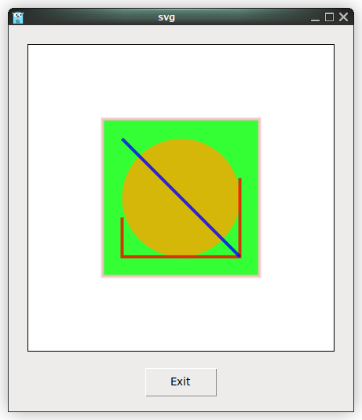
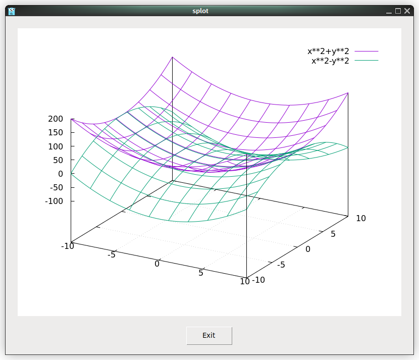
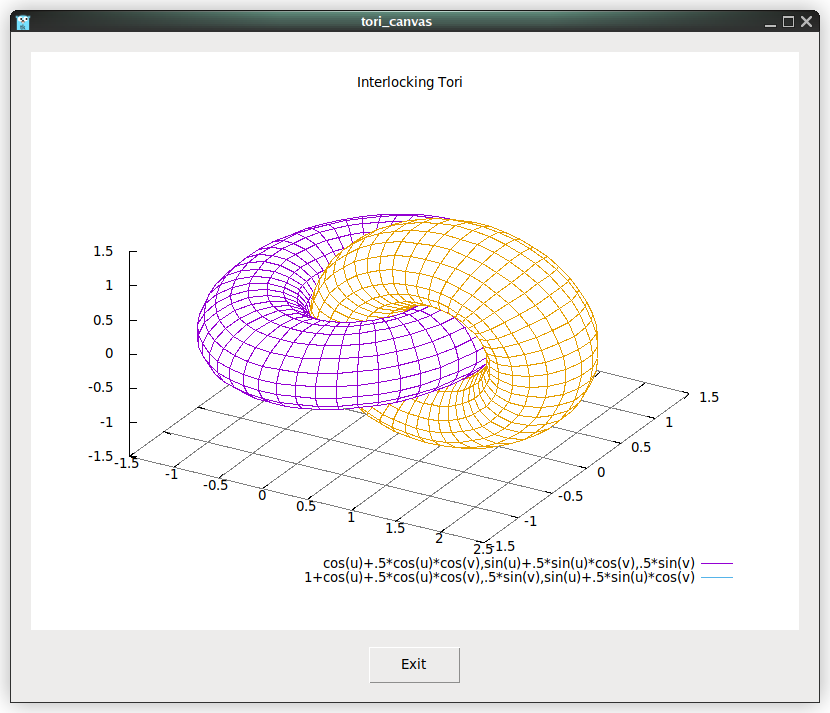

# tk9.0: The CGo-free cross platform GUI for Go

Using embedded images (_examples/photo.go).

     1	package main
     2	
     3	import _ "embed"
     4	import . "modernc.org/tk9.0"
     5	
     6	//go:embed gopher.png
     7	var gopher []byte
     8	
     9	func main() {
    10		Pack(Label(Image(NewPhoto(Data(gopher)))), TExit(), Padx("1m"), Pady("2m"), Ipadx("1m"), Ipady("1m"))
    11		App.Configure(Padx("4m"), Pady("3m")).Center().Wait()
    12	}

Using svg (_examples/svg.go).

     1	package main
     2	
     3	import . "modernc.org/tk9.0"
     4	
     5	// https://en.wikipedia.org/wiki/SVG
     6	const svg = `<?xml version="1.0" encoding="UTF-8" standalone="no"?>
     7	<!DOCTYPE svg PUBLIC "-//W3C//DTD SVG 1.1//EN" "http://www.w3.org/Graphics/SVG/1.1/DTD/svg11.dtd">
     8	<svg width="391" height="391" viewBox="-70.5 -70.5 391 391" xmlns="http://www.w3.org/2000/svg" xmlns:xlink="http://www.w3.org/1999/xlink">
     9	<rect fill="#fff" stroke="#000" x="-70" y="-70" width="390" height="390"/>
    10	<g opacity="0.8">
    11		<rect x="25" y="25" width="200" height="200" fill="lime" stroke-width="4" stroke="pink" />
    12		<circle cx="125" cy="125" r="75" fill="orange" />
    13		<polyline points="50,150 50,200 200,200 200,100" stroke="red" stroke-width="4" fill="none" />
    14		<line x1="50" y1="50" x2="200" y2="200" stroke="blue" stroke-width="4" />
    15	</g>
    16	</svg>`
    17	
    18	func main() {
    19		Pack(
    20			Label(Image(NewPhoto(Data(svg)))),
    21			TExit(), Padx("1m"), Pady("2m"), Ipadx("1m"), Ipady("1m"),
    22		)
    23		App.Configure(Padx("4m"), Pady("3m")).Center().Wait()
    24	}

A simple calculator (_examples/calc.go).

     1	package main
     2	
     3	import "github.com/expr-lang/expr"
     4	import 	. "modernc.org/tk9.0"
     5	
     6	func main() {
     7		out := Label(Height(2), Anchor("e"), Txt("(123+232)/(123-10)"))
     8		Grid(out, Columnspan(4), Sticky("e"))
     9		var b *ButtonWidget
    10		for i, c := range "C()/789*456-123+0.=" {
    11			b = Button(Txt(string(c)), Command(
    12				func() {
    13					switch c {
    14					case 'C':
    15						out.Configure(Txt(""))
    16					case '=':
    17						x, err := expr.Eval(out.Txt(), nil)
    18						if err != nil {
    19							MessageBox(Icon("error"), Msg(err.Error()), Title("Error"))
    20							x = ""
    21						}
    22						out.Configure(Txt(x))
    23					default:
    24						out.Configure(Txt(out.Txt() + string(c)))
    25					}
    26				},
    27			))
    28			Grid(b, Row(i/4+1), Column(i%4), Sticky("news"), Ipadx("1.5m"), Ipady("2.6m"))
    29		}
    30		Grid(b, Columnspan(2))
    31		App.Wait()
    32	}

A font previewer (_examples/font.go).

     1	package main
     2	
     3	import . "modernc.org/tk9.0"
     4	
     5	func main() {
     6		t := Text(Wrap("none"))
     7		for i, v := range FontFamilies() {
     8			t.TagConfigure(t.TagAdd(t.Insert(LC{i + 1, 0}, v+"\n"), LC{i + 2, 0}), Fnt(NewFont(Family(v))))
     9		}
    10		Pack(t, TExit(), Padx("1m"), Pady("2m"), Ipadx("1m"), Ipady("1m"))
    11		App.Configure(Padx("4m"), Pady("3m")).Center().Wait()
    12	}

Surface plot (_examples/splot.go).

     1	package main
     2	
     3	import . "modernc.org/tk9.0"
     4	
     5	func main() {
     6		Pack(
     7			Label(Image(NewPhoto(Width(800), Height(600)).Graph("set grid; splot x**2+y**2, x**2-y**2"))),
     8			TExit(), Padx("1m"), Pady("2m"), Ipadx("1m"), Ipady("1m"),
     9		)
    10		App.Configure(Padx("4m"), Pady("3m")).Center().Wait()
    11	}

Interlocked tori plot (_examples/tori.go).

     1	package main
     2	
     3	import . "modernc.org/tk9.0"
     4	
     5	// https://gnuplot.sourceforge.net/demo_5.4/hidden2.html
     6	const script = `
     7	set multiplot title "Interlocking Tori"
     8	set title "PM3D surface\nno depth sorting"
     9	set parametric
    10	set urange [-pi:pi]
    11	set vrange [-pi:pi]
    12	set isosamples 50,20
    13	set origin -0.02,0.0
    14	set size 0.55, 0.9
    15	unset key
    16	unset xtics
    17	unset ytics
    18	unset ztics
    19	set border 0
    20	set view 60, 30, 1.5, 0.9
    21	unset colorbox
    22	set pm3d scansbackward
    23	splot cos(u)+.5*cos(u)*cos(v),sin(u)+.5*sin(u)*cos(v),.5*sin(v) with pm3d,1+cos(u)+.5*cos(u)*cos(v),.5*sin(v),sin(u)+.5*sin(u)*cos(v) with pm3d
    24	set title "PM3D surface\ndepth sorting"
    25	set origin 0.40,0.0
    26	set size 0.55, 0.9
    27	set colorbox vertical user origin 0.9, 0.15 size 0.02, 0.50
    28	set format cb "%.1f"
    29	set pm3d depthorder
    30	splot cos(u)+.5*cos(u)*cos(v),sin(u)+.5*sin(u)*cos(v),.5*sin(v) with pm3d,1+cos(u)+.5*cos(u)*cos(v),.5*sin(v),sin(u)+.5*sin(u)*cos(v) with pm3d
    31	unset multiplot
    32	`
    33	
    34	func main() {
    35		Pack(
    36			Label(Image(NewPhoto(Width(800), Height(600)).Graph(script))),
    37			TExit(), Padx("1m"), Pady("2m"), Ipadx("1m"), Ipady("1m"),
    38		)
    39		App.Configure(Padx("4m"), Pady("3m")).Center().Wait()
    40	}

Interlocked tori plot on canvas (_examples/tori_canvas.go).

     1	package main
     2	
     3	import . "modernc.org/tk9.0"
     4	
     5	// https://gnuplot.sourceforge.net/demo_5.4/surface2.9.gnu
     6	const script = `
     7	set dummy u, v
     8	set key bmargin center horizontal Right noreverse enhanced autotitle nobox
     9	set parametric
    10	set view 50, 30, 1, 1
    11	set isosamples 50, 20
    12	set hidden3d back offset 1 trianglepattern 3 undefined 1 altdiagonal bentover
    13	set style data lines
    14	set xyplane relative 0
    15	set title "Interlocking Tori" 
    16	set grid
    17	set urange [ -3.14159 : 3.14159 ] noreverse nowriteback
    18	set vrange [ -3.14159 : 3.14159 ] noreverse nowriteback
    19	set xrange [ * : * ] noreverse writeback
    20	set x2range [ * : * ] noreverse writeback
    21	set yrange [ * : * ] noreverse writeback
    22	set y2range [ * : * ] noreverse writeback
    23	set zrange [ * : * ] noreverse writeback
    24	set cbrange [ * : * ] noreverse writeback
    25	set rrange [ * : * ] noreverse writeback
    26	set colorbox vertical origin screen 0.9, 0.2 size screen 0.05, 0.6 front  noinvert bdefault
    27	NO_ANIMATION = 1
    28	splot cos(u)+.5*cos(u)*cos(v),sin(u)+.5*sin(u)*cos(v),.5*sin(v) with lines,1+cos(u)+.5*cos(u)*cos(v),.5*sin(v),sin(u)+.5*sin(u)*cos(v) with lines
    29	`
    30	
    31	func main() {
    32		Pack(
    33			Canvas(Width(800), Height(600), Background(White)).Graph(script),
    34			TExit(), Padx("1m"), Pady("2m"), Ipadx("1m"), Ipady("1m"),
    35		)
    36		App.Configure(Padx("4m"), Pady("3m")).Center().Wait()
    37	}

Cascading menus (_examples/menu.go)

     1	package main
     2	
     3	import (
     4		"fmt"
     5		"runtime"
     6		. "modernc.org/tk9.0"
     7	)
     8	
     9	func main() {
    10		menubar := Menu()
    11	
    12		fileMenu := menubar.Menu()
    13		fileMenu.AddCommand(Lbl("New"), Underline(0), Accelerator("Ctrl+N"))
    14		fileMenu.AddCommand(Lbl("Open..."), Underline(0), Accelerator("Ctrl+O"), Command(func() { GetOpenFile() }))
    15		Bind(App, "<Control-o>", Command(func() { fileMenu.Invoke(1) }))
    16		fileMenu.AddCommand(Lbl("Save"), Underline(0), Accelerator("Ctrl+S"))
    17		fileMenu.AddCommand(Lbl("Save As..."), Underline(5))
    18		fileMenu.AddCommand(Lbl("Close"), Underline(0), Accelerator("Crtl+W"))
    19		fileMenu.AddSeparator()
    20		fileMenu.AddCommand(Lbl("Exit"), Underline(1), Accelerator("Ctrl+Q"), ExitHandler())
    21		Bind(App, "<Control-q>", Command(func() { fileMenu.Invoke(6) }))
    22		menubar.AddCascade(Lbl("File"), Underline(0), Mnu(fileMenu))
    23	
    24		editMenu := menubar.Menu()
    25		editMenu.AddCommand(Lbl("Undo"))
    26		editMenu.AddSeparator()
    27		editMenu.AddCommand(Lbl("Cut"))
    28		editMenu.AddCommand(Lbl("Copy"))
    29		editMenu.AddCommand(Lbl("Paste"))
    30		editMenu.AddCommand(Lbl("Delete"))
    31		editMenu.AddCommand(Lbl("Select All"))
    32		menubar.AddCascade(Lbl("Edit"), Underline(0), Mnu(editMenu))
    33	
    34		helpMenu := menubar.Menu()
    35		helpMenu.AddCommand(Lbl("Help Index"))
    36		helpMenu.AddCommand(Lbl("About..."))
    37		menubar.AddCascade(Lbl("Help"), Underline(0), Mnu(helpMenu))
    38	
    39		App.WmTitle(fmt.Sprintf("%s on %s", App.WmTitle(""), runtime.GOOS))
    40		App.Configure(Mnu(menubar), Width("8c"), Height("6c"), Padx("4m"), Pady("3m")).Center().Wait()
    41	}

Documentation at [pkg.go.dev].

[pkg.go.dev]: https://pkg.go.dev/modernc.org/tk9.0
